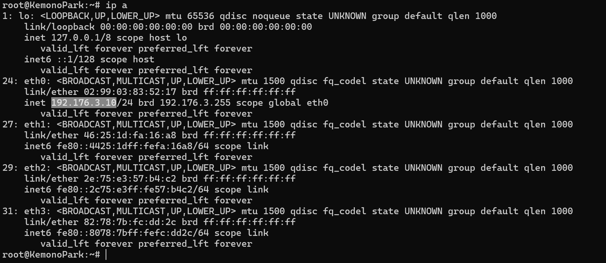
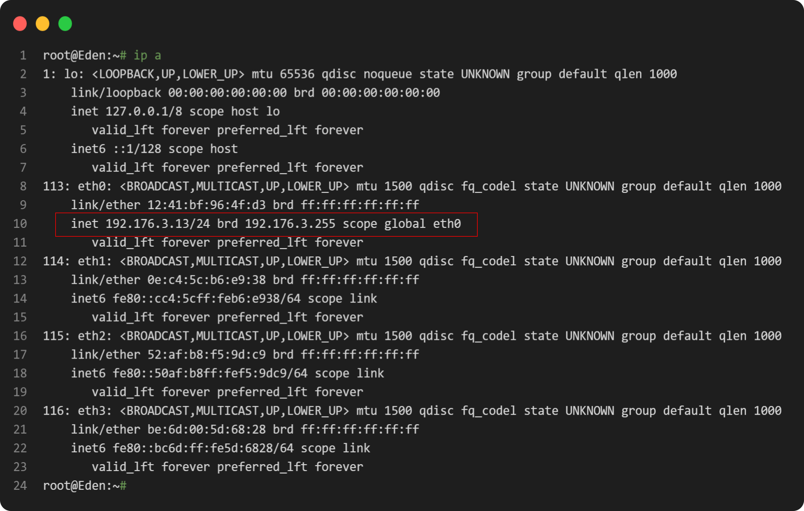

# Laporan Praktikum JARKOM Kelompok B07 #

| Nama                      | NRP           |
| ------------------------- | ------------- |
| Danial Farros Maulana     | 5025201004    |
| Rendi Dwi Francisko       | 5025201056    |
| Ahmad Ibnu Malik Rahman   | 5025201232    |


## Pembahasan soal Modul DHCP ##

### Nomer 1 ###
Loid bersama Franky berencana membuat peta tersebut dengan kriteria WISE sebagai DNS Server, Westalis sebagai DHCP Server, Berlint sebagai Proxy Server
**Jawab :**


#### (DNS Server) Wise ####
network configuration

```
auto eth0
iface eth0 inet static
	address 192.176.2.2
	netmask 255.255.255.0
	gateway 192.176.2.1
```
Bashrc

```
echo "nameserver 192.168.122.1" > /etc/resolv.conf
apt-get update
apt-get install bind9 -y
```

#### (DHCP Server) Westalis ####
network configuration

```
auto eth0
iface eth0 inet static
	address 192.176.2.4
	netmask 255.255.255.0
	gateway 192.176.2.1
```
Bashrc

```
echo "nameserver 192.168.122.1" > /etc/resolv.conf
apt-get update
apt-get install isc-dhcp-server -y
```


#### (Proxy Server) Berlint ####
network configuration

```
auto eth0
iface eth0 inet static
	address 192.176.2.3
	netmask 255.255.255.0
	gateway 192.176.2.1
```
Bashrc

```
echo "nameserver 192.168.122.1" > /etc/resolv.conf
apt-get update
apt-get install libapache2-mod-php7.0 -y
apt-get install squid -y
```

### Nomer 2 ###
dan Ostania sebagai DHCP Relay 
**Jawab :**
#### (DHCP relay) Ostania ####
network configuration

```
auto eth0
iface eth0 inet dhcp

auto eth1
iface eth1 inet static
	address 192.176.1.1
	netmask 255.255.255.0

auto eth2
iface eth2 inet static
	address 192.176.2.1
	netmask 255.255.255.0

auto eth3
iface eth3 inet static
	address 192.176.3.1
	netmask 255.255.255.0
```
Bashrc

```
apt-get update
iptables -t nat -A POSTROUTING -o eth0 -j MASQUERADE -s 192.176.0.0/16
apt-get install isc-dhcp-relay -y
service isc-dhcp-relay restart
```
isi SERVERS="192.176.2.4" dan INTERFACES="eth1 eth3 eth2"

### Nomer 3-4 ###
Ada beberapa kriteria yang ingin dibuat oleh Loid dan Franky, yaitu:
Semua client yang ada HARUS menggunakan konfigurasi IP dari DHCP Server.
Client yang melalui Switch1 mendapatkan range IP dari [prefix IP].1.50 - [prefix IP].1.88 dan [prefix IP].1.120 - [prefix IP].1.155 (3)
Client yang melalui Switch3 mendapatkan range IP dari [prefix IP].3.10 - [prefix IP].3.30 dan [prefix IP].3.60 - [prefix IP].3.85 (4)

**Jawab :**

#### (Client) SSS,Garden,KemonoPark,NewstonCastle ####
network configuration

```
auto eth0
iface eth0 inet dhcp
```
#### (Client) Eden ####
network configuration

```
auto eth0
iface eth0 inet dhcp
hwaddress ether 12:41:bf:96:4f:d3
```
Westalis
kemudian tambahkan `INTERFACES=\"eth0\"` pada `/etc/default/isc-dhcp-server`
lalu tambahkan juga
```
subnet 192.176.1.0 netmask 255.255.255.0 {
    range  192.176.1.50 192.176.1.88;
    range  192.176.1.120 192.176.1.155;
    option routers 192.176.1.1;
    option broadcast-address 192.176.1.255;
    option domain-name-servers 192.176.2.2;
}
subnet 192.176.3.0 netmask 255.255.255.0 {
    range  192.176.3.10 192.176.3.30;
    range  192.176.3.60 192.176.3.85;
    option routers 192.176.3.1;
    option broadcast-address 192.176.3.255;
    option domain-name-servers 192.176.2.2;
}
``` 
pada `/etc/dhcp/dhcpd.conf` dan jangan lupa restart `service isc-dhcp-server restart`
lalu cek dengan command `ip a` pada client

#### switch1 ####

#### switch2 ####


### Nomer 5 ###
Client mendapatkan DNS dari WISE dan client dapat terhubung dengan internet melalui DNS tersebut.

**Jawab :**

pada setiap client akan mendapatkan DNS dari WISE sehingga diperlukan konfigurasi pada file `/etc/dhcp/dhcpd.conf` dengan isian sebagai berikut

```sh
option domain-name-servers 10.45.2.2;
```

melakukan setup pada WISE dengan melakukan editing pada file `/etc/bind/named.conf.options` dan menambahkan isian sebagai berikut :

```sh
options {
        directory "/var/cache/bind";
        forwarders {
                8.8.8.8;
                8.8.8.4;
        };
        // dnssec-validation auto;
        allow-query { any; };
        auth-nxdomain no;    # conform to RFC1035
        listen-on-v6 { any; };
};
```
untuk memastikan code berjalan sesuai dengan aturan maka dilakukann pengecekan dengan melakukan ping pada setiap client :
- SSS
  
- Garden

- KemonoPark

- NewstonCastle

- Eden
  

### Nomer 6 ###
Lama waktu DHCP server meminjamkan alamat IP kepada Client yang melalui Switch1 selama 5 menit sedangkan pada client yang melalui Switch3 selama 10 menit. Dengan waktu maksimal yang dialokasikan untuk peminjaman alamat IP selama 115 menit.

**Jawab :**

Pada node Wesalis lakukan perintah sebagai berikut :

- edit file /etc/bind/named.conf.local dengan cara
  
    ```
	nano /etc/bind/named.conf.local
	```
- menyesuaikan isi file dengan
	```
		subnet 192.176.2.0 netmask 255.255.255.0 {
		}
		subnet 192.176.1.0 netmask 255.255.255.0 {
			...
			default-lease-time 300;
			max-lease-time 6900;
			...
		}
		subnet 192.176.3.0 netmask 255.255.255.0 {
			...
			option domain-name-servers 192.176.2.2;
			default-lease-time 600;
			...
		}
	```

### Nomer 7 ###
Loid dan Franky berencana menjadikan Eden sebagai server untuk pertukaran informasi dengan alamat IP yang tetap dengan IP [prefix IP].3.13

**Jawab :**

Pada node Wesalis lakukan perintah sebagai berikut :
- edit file /etc/bind/named.conf.local dengan cara
  
    ```
	nano /etc/bind/named.conf.local
	```
- manambhakan isi file dengan
	```
	host Eden {
		hardware ethernet 12:41:bf:96:4f:d3;
		fixed-address 192.176.3.13;
	}
	```
Pada node **Eden** melakukan konfigurasi network configuration sebagai berikut :
```
auto eth0
iface eth0 inet dhcp
hwaddress ether 12:41:bf:96:4f:d3
```
untuk melakukan validasi maka pada node Eden dilakukan pengecekan dengan menggunakan `ip a`, akan muncul hasil sebagai berikut


## Pembahasan soal Modul PROXY Server ##

### Nomer 1 ###
Client hanya dapat mengakses internet diluar (selain) hari & jam kerja (senin-jumat 08.00 - 17.00) dan hari libur (dapat mengakses 24 jam penuh)

**Jawaban :**

Pada node Berlint lakukan perintah sebagai berikut :
- edit file /etc/squid/acl.conf dengan cara
  
    ```
	nano /etc/squid/acl.conf
	```
- manambhakan isi file dengan
	```
	acl AVAILABLE_WORKING time MTWHF 17:01-23:59
	acl AVAILABLE_WORKING time MTWHF 00:00-07:59
	acl AVAILABLE_WORKING time AS 00:00-23:59
	acl jam_kerja time MTWHF 08:00-17:00
	acl weekend time AS 00:00-23:59
	```
- edit file /etc/squid/acl.conf dengan cara
  
    ```
	nano /etc/squid/squid.conf
	```
- manambhakan isi file dengan
	```
	include etc/squid/acl.conf
	http_port 8080
	visible_hostname Berlint
	http_access allow AVAILABLE_WORKING
	http_access deny all
	```
- Melakukan restart service squid dengan ssyntax berikut 
  ```
  service squid restart
  ```
- jangan lupa export http pada client dengan cara
  ```
  export http_proxy="http://192.176.2.3:8080"
  ```
untuk melakukan validasi kode dilakukan testing
- testing hari kerja 
  - dilakukan dengan menset jam dan mengganti dengan jam kerja

	```
	date --set "14 nov 2022 09:00:00"
	```
	- mencoba koneksi dengan
	```
	wget google.com
	```
	- koneksi di tolak dan menampilkan hasil sebagai berikut
	
- testing non hari kerja 
  - dilakukan dengan menset jam dan mengganti dengan bukan jam kerja

	```
	date --set "6 nov 2022 18:00:00"
	```
	- mencoba koneksi dengan
	```
	lynx http://its.ac.id
	```
	- koneksi diterima dan menampilkan hasil sebagai berikut
	

### Nomer 2 ###
Adapun pada hari dan jam kerja sesuai nomor (1), client hanya dapat mengakses domain loid-work.com dan franky-work.com (IP tujuan domain dibebaskan)

**jawab :**

- Buat domain pada wise berikut scriptnya
```
mkdir /etc/bind/jarkom3
echo '
zone "loid-work.com" {
        type master;
        file "/etc/bind/jarkom3/loid-work.com";
};' > /etc/bind/named.conf.local

echo '
;
; BIND data file for local loopback interface
;
$TTL    604800
@       IN      SOA     loid-work.com. root.loid-work.com. (
                        2022110901      ; Serial
                         604800         ; Refresh
                          86400         ; Retry
                        2419200         ; Expire
                         604800 )       ; Negative Cache TTL
;
@       IN      NS      loid-work.com.
@       IN      A       192.176.2.2
@     IN      AAAA   ::1
' > /etc/bind/jarkom3/loid-work.com

echo '
zone "franky-work.com" {
        type master;
        file "/etc/bind/jarkom3/franky-work.com";
};' >>/etc/bind/named.conf.local

echo '
;
; BIND data file for local loopback interface
;
$TTL    604800
@       IN      SOA     franky-work.com. root.franky-work.com. (
                        2022110901      ; Serial
                         604800         ; Refresh
                          86400         ; Retry
                        2419200         ; Expire
                         604800 )       ; Negative Cache TTL
;
@       IN      NS      franky-work.com.
@       IN      A       192.176.2.2
@     IN      AAAA   ::1
' > /etc/bind/jarkom3/franky-work.com
service bind9 restart
```
- buat file /etc/squid/access.conf dengan cara (berlint)
  
    ```
	nano /etc/squid/access.conf
	```
- manambahkan isi file dengan
	```
	loid-work.com
	franky-work.com
	```
- edit file /etc/squid/squid.conf dengan cara
  
    ```
	nano /etc/squid/squid.conf
	```
- manambhakan isi file dengan
	```
	.....
	acl WORKSITES dstdomain "/etc/squid/access.acl"
	http_access allow WORKSITES
	.....
	```

untuk melakukan validasi kode dilakukan testing
- testing hari kerja 
  - dilakukan dengan menset jam dan mengganti dengan jam kerja

	```
	date --set "14 nov 2022 09:00:00"
	```
	- mencoba koneksi dengan
	```
	lynx loid-work.com
	```
	- koneksi diterima namun menampilan respon berikut karena site belum di availible
	
- testing non hari kerja 
  - dilakukan dengan menset jam dan mengganti dengan bukan jam kerja

	```
	date --set "6 nov 2022 18:00:00"
	```
	- mencoba koneksi dengan
	```
	lynx loid-work.com
	```
	- koneksi ditolak dan menampilkan hasil sebagai berikut
	
### Nomer 3 ###
Saat akses internet dibuka, client dilarang untuk mengakses web tanpa HTTPS. (Contoh web HTTP: http://example.com)

**jawab :**

#### Berlint ####
- edit file /etc/squid/acl.conf dengan cara
  
    ```
	nano /etc/squid/acl.conf
	```
- manambhakan isi file dengan
	```
	.....
	acl SSL_ports port 443
	http_access deny !SSL_ports
	.....
untuk melakukan validasi kode dilakukan testing
- Lakukan dengan HTTP
	- mencoba koneksi dengan
	```
	lynx http://its.ac.id
	```
	- koneksi ditolak karena bukan HTTPS
	
- Lakukan dengan HTTPS
- mencoba koneksi dengan
	```
	lynx https://its.ac.id
	```
	- koneksi diterima karena HTTPS
	

### Nomer 4 ###
Agar menghemat penggunaan, akses internet dibatasi dengan kecepatan maksimum 128 Kbps pada setiap host (Kbps = kilobit per second; lakukan pengecekan pada tiap host, ketika 2 host akses internet pada saat bersamaan, keduanya mendapatkan speed maksimal yaitu 128 Kbps)


**jawab :**

- buat file /etc/squid/acl.conf dengan cara
  
    ```
	nano /etc/squid/acl-bandwidth.conf
	```
- manambhakan isi file dengan
	```
	.....
	delay_pools 1
	delay_class 1 1
	delay_access 1 allow all
	delay_parameters 1 16000/16000
	.....
- edit file /etc/squid/acl.conf dengan cara
  
    ```
	nano /etc/squid/acl.conf
	```
- manambhakan isi file dengan
	```
	.....
	include /etc/squid/acl-bandwidth.conf
	.....
- Lakukan test
	- Dengan pembatasan speed
		
	- Tanpa pembatasan speed
		

### Nomer 5 ###
Setelah diterapkan, ternyata peraturan nomor (4) mengganggu produktifitas saat hari kerja, dengan demikian pembatasan kecepatan hanya diberlakukan untuk pengaksesan internet pada hari libur

**Jawab:**
- edit file /etc/squid/acl.conf dengan cara
  
    ```
	nano /etc/squid/acl.conf
	```
- manambhakan isi file dengan
	```
	.....
	http_access allow !WORKSITES !AVAILABLE_WORKING
	http_access allow WORKSITES AVAILABLE_WORKING
	.....


## Kendala ##
- tidak ada
